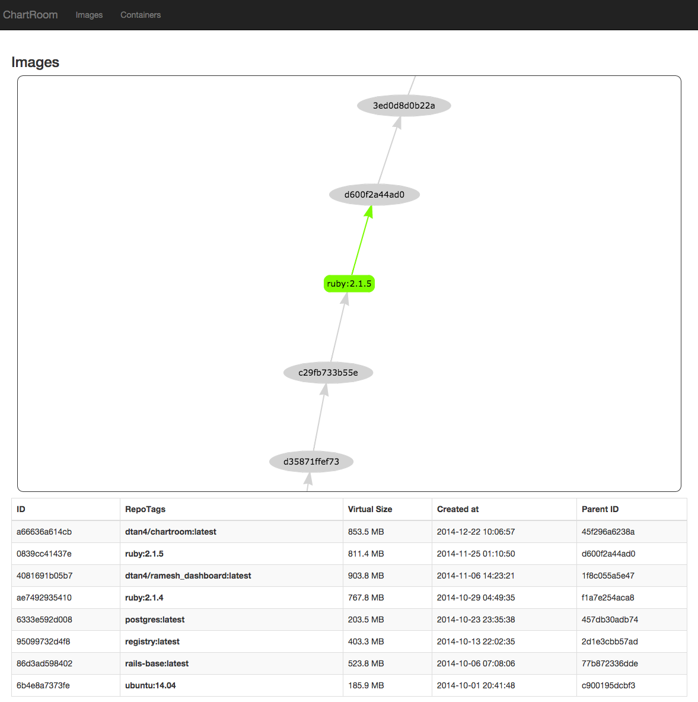

# Chartroom

[](https://travis-ci.org/dtan4/chartroom)
[](https://coveralls.io/r/dtan4/chartroom?branch=add-tests)

Look down Docker images, containers and their structure.

## Run as a Docker container

Chartroom Docker image is available at [quay.io/dtan4/chartroom](https://quay.io/repository/dtan4/chartroom).

[](https://quay.io/repository/dtan4/chartroom)

```shell
$ docker run -p 9292:9292 -v /var/run/docker.sock:/var/run/docker.sock dtan4/chartroom
```

Then you can see dashboard by accessing `http://[DOCKER_HOST]:9292/`.

__NOTE:__ Please DO NOT forget `-v /var/run/docker.sock:/var/run/docker.sock` option!

## Run on the local machine

```shell
$ git clone https://github.com/dtan4/chartroom.git
$ cd chartroom
$ bundle install
$ bundle exec rackup -p 9292
```

Then you can see dashboard by accessing `http://localhost:9292/`.

## Screenshot



## License

[](LICENSE)
